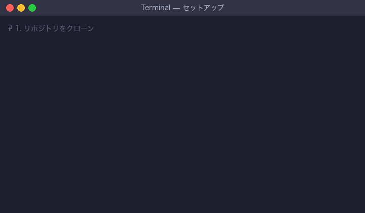
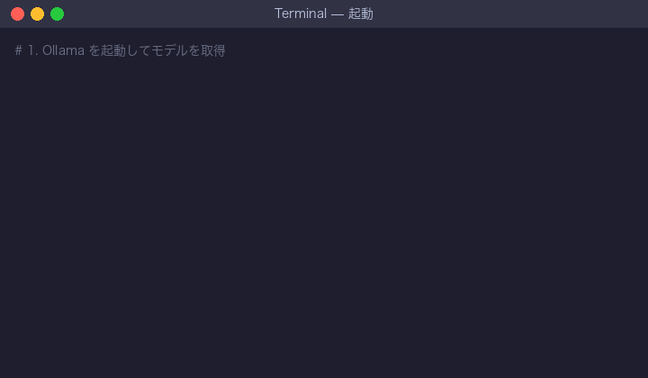
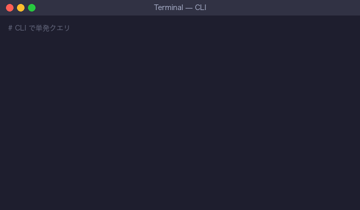

# 謎の国家 — RAG 精度検証・比較ツール

架空の国家の法体系を題材にした **RAG (Retrieval-Augmented Generation)** システム。
AI による司法判断の精度を検証・比較するためのツールキットです。

## 🚀 クイックスタート（最短コース）

```bash
# 1. セットアップ
python3 -m venv .venv && source .venv/bin/activate
pip install -r requirements.txt

# 2. 書庫を構築（数分）
python -m rag_system.ingest

# 3. ベクトル可視化を即体験（Ollama 不要、CLI から）
python -m rag_system.vector_analysis story
# → 桃太郎・浦島太郎・三匹の子豚・謎の国家法令の類似度マトリックスが表示される

# 4. Streamlit Web UI（推奨）
streamlit run app.py
# → ブラウザで「ベクトル可視化」ページに移動
```

> 💡 「Q&A チャット」は別途 `ollama serve` が必要。
> 「ベクトル可視化」は埋め込みモデルだけで動くので Ollama 不要です。

## 🔬 解析ツール（Ollama 不要で最も手軽）

埋め込み空間を多角的に探索できる Streamlit ツール。**Ollama 不要**で、書庫の取り込み（`python -m rag_system.ingest`）さえ済めば動きます。RAG の「似ている／似ていない」が目で見えます。

```bash
./run_tool.sh          # または:  streamlit run highlight_tool.py
```

6 つのタブで書庫を解析できます：

| タブ | できること |
|------|-----------|
| 🎨 ハイライト | 2 テキストの「どこが似ているか」を 3 方式（文／トークン／ペアリング）で色付け |
| 🧭 意味軸 | PCA 主成分・任意 2 グループの概念軸とその分散 |
| 🗺️ 書庫マップ | 全文書を 2D/3D 散布図で配置（PCA/t-SNE・グループ色分け） |
| 🔍 クエリ探索 | 質問で近傍検索＋クエリと文書の語ハイライト |
| 🎯 クラスタ発見 | K-means で意味グループを自動発見、人手ラベルと比較 |
| 🔗 重複検出 | 似すぎる文書ペアを抽出（冗長性チェック） |

> 物語（昔話・童話 35 話）も書庫に同梱済み。書庫マップで「物語の島」が、クラスタ発見で「物語が独自クラスタにまとまる」のが見えます。再取り込みは `python add_extra.py`。

### 📖 仕組みの図解（ダウンロードしてブラウザで開くだけ）

数式や専門用語が苦手でも、まず図から理解できる教材を用意しています：

| ファイル | 内容 |
|---------|------|
| [`docs/embedding_explained.html`](docs/embedding_explained.html) | **RAG のベクトルの正体**（文字→トークン→平均→意味ベクトル、の概念図解） |
| [`docs/embedding_real.html`](docs/embedding_real.html) | 実データで検証（トークンの実ベクトル・平均＝文ベクトル・文脈依存） |
| [`docs/infographic.html`](docs/infographic.html) | 類似度ハイライトと 768 次元の軸抽出の仕組み |
| [`docs/result.html`](docs/result.html) | 桃太郎×浦島太郎の実データ結果 |
| [`docs/demo.html`](docs/demo.html) | 1,399 文書の解析デモ（散布図・クラスタ・検索・重複） |

詳しい使い方は [`docs/TOOL_USAGE.md`](docs/TOOL_USAGE.md) を参照。

## 概要

「謎の国家」は、独自の憲法・刑法・民法・行政法・文化規制・倫理指針を持つ架空の国家です。
本プロジェクトは、この法体系と 1,206 件の判例データベースを知識ベースとして、LLM が法律質問に対して構造化された司法判断を生成し、その精度を評価するシステムを提供します。

### 主な機能

- **法律 Q&A チャット** — 法律に関する質問に対し、条文引用・判例参照付きで司法判断を生成
- **エージェントモード** — ReAct エージェントがツールを自律的に選択・実行して法的質問に回答
- **ベクトル可視化** — 書庫を 2D/3D にマッピング、クエリの近傍探索、類似度ヒートマップ、桃太郎/浦島太郎メタファーで RAG の「似ている／似ていない」感覚を直観化
- **検索パイプライン比較**（NEW） — 密ベクトル検索 vs ハイブリッド検索（BM25 融合）vs リランク（cross-encoder）を並べて比較し、各段で結果がどう変わるかを順位の矢印で可視化
- **ハイブリッド検索＋リランク**（NEW） — BM25 キーワード検索と密ベクトル検索を RRF で融合し、cross-encoder で再採点する実運用相当の検索パイプライン
- **書庫アクセスツール** — 法令検索・判例検索・書庫統計の 3 つの LangChain Tool を提供
- **複数モデル精度比較** — 異なる LLM 設定間で回答精度を定量的に比較
- **テストケース管理** — 検証用のテストケースを作成・管理（CRUD）。判例由来の拡張スイート（127 件）を 1 クリックで読み込み可能
- **ベクトル検索** — ChromaDB を用いた法的文書・判例の類似度検索

## プロジェクト構成

```
nazono-kokka/
├── app.py                    # Streamlit エントリーポイント
├── requirements.txt          # Python 依存パッケージ
├── rag_system/               # RAG コアシステム
│   ├── config.py             # 設定（パス, LLM, Embedding, チャンク等）
│   ├── main.py               # CLI インターフェース
│   │                         # --- AI（推論・生成）---
│   ├── judge.py              # 司法推論チェーン（LangChain RetrievalQA）
│   ├── tools.py              # LangChain Tool 定義（法令検索・判例検索・書庫統計）
│   ├── agent.py              # ReAct エージェント（ツール自律選択）
│   ├── backend_adapter.py    # LLM バックエンド抽象化（Ollama）
│   ├── comparison_engine.py  # 複数モデル精度比較エンジン
│   ├── metrics.py            # 評価メトリクス算出
│   │                         # --- DB（データ・検索）---
│   ├── ingest.py             # ドキュメント取り込み → ChromaDB
│   ├── retriever.py          # ベクトル類似度検索・メタデータフィルタ
│   ├── vector_analysis.py    # ベクトル可視化用の射影・類似度計算
│   └── test_cases.py         # テストケース管理
├── ui/                       # Streamlit Web UI
│   ├── chat_page.py          # チャットページ
│   ├── visualization_page.py # ベクトル可視化ページ
│   ├── settings_page.py      # 設定ページ
│   ├── testcase_page.py      # テストケース管理ページ
│   ├── comparison_page.py    # 精度比較ダッシュボード
│   └── components.py         # 共通 UI コンポーネント
├── legal_framework/          # 法体系ドキュメント（Markdown）
│   ├── constitution.md       # 憲法（約 30 KB）
│   ├── criminal_code.md      # 刑法（約 75 KB）
│   ├── civil_code.md         # 民法（約 79 KB）
│   ├── administrative_code.md # 行政法（約 49 KB）
│   ├── cultural_regulations.md # 文化規制（約 25 KB）
│   └── ethical_guidelines.md # 倫理指針（約 25 KB）
├── precedents/               # 判例データベース（JSON, 全 1,206 件）
│   ├── metadata.json         # 判例メタデータインデックス
│   ├── criminal/             # 刑事判例（486 件）
│   ├── civil/                # 民事判例（510 件）
│   └── constitutional/       # 憲法判例（210 件）
├── test_cases/               # テストケース定義・結果
│   ├── default_cases.json    # デフォルトテストケース（15 件以上）
│   └── results/              # 比較結果出力先
├── tests/                    # ユニットテスト・統合テスト
├── docs/                     # 解説ドキュメント
│   ├── VECTOR_SPACE.md       # ベクトル空間の概念ガイド（桃太郎メタファー）
│   └── SAMPLE_OUTPUT.md      # CLI と Streamlit のサンプル出力集
└── scripts/                  # データ生成・検証スクリプト
    ├── generate_legal_framework.py
    ├── generate_precedents.py
    ├── validate_data.py
    ├── verify_e2e.sh
    └── vector_space_demo.py  # Python API のサンプル（書庫統計→物語類似度→クロスドメイン）
```

## 技術スタック

### AI（推論・生成）

| レイヤー | 技術 | 説明 |
|----------|------|------|
| LLM バックエンド | [Ollama](https://ollama.ai) | ローカル LLM 実行基盤 |
| 推奨モデル | `schroneko/llama-3.1-swallow-8b-instruct-v0.1` | 日本語対応 8B モデル |
| フォールバックモデル | `llama3.1:8b` | 汎用英語モデル |
| RAG フレームワーク | [LangChain](https://www.langchain.com/) | RetrievalQA チェーン、ReAct エージェント |
| エージェント | LangChain ReAct Agent | ツール自律選択による多段推論 |

### DB（データ・検索）

| レイヤー | 技術 | 説明 |
|----------|------|------|
| ベクトル DB | [ChromaDB](https://www.trychroma.com/) | ドキュメント埋め込みの永続化・類似度検索 |
| Embedding モデル | HuggingFace `paraphrase-multilingual-mpnet-base-v2` | 多言語対応の文埋め込みモデル |
| コレクション名 | `nazono_kokka_legal` | 法令 148 チャンク + 判例 1,206 チャンク = 計 1,354 チャンク |
| 法体系ソース | Markdown（6 ファイル, 約 296 KB） | 憲法・刑法・民法・行政法・文化規制・倫理指針 |
| 判例ソース | JSON（1,206 ファイル, 約 5.3 MB） | 刑事 486 件・民事 510 件・憲法 210 件 |

### その他

| レイヤー | 技術 |
|----------|------|
| Web UI | [Streamlit](https://streamlit.io/) |
| 可視化 | [Plotly](https://plotly.com/) |
| テスト | pytest |

## デモ

### セットアップ


### 起動


### CLI 実行


## セットアップ

### 前提条件

- Python 3.11 以上
- [Ollama](https://ollama.ai) がインストール済み
- jq（E2E 検証スクリプト用、任意）

### 1. リポジトリのクローン

```bash
git clone https://github.com/shigenoburyuto/nazono-kokka.git
cd nazono-kokka
```

### 2. 仮想環境の作成と依存パッケージのインストール

```bash
python3 -m venv .venv
source .venv/bin/activate
pip install -r requirements.txt
```

### 3. AI セットアップ（Ollama）

Ollama サーバーを起動し、使用するモデルをダウンロードします。

```bash
# Ollama サーバー起動
ollama serve

# 推奨モデルのダウンロード（別ターミナルで実行）
ollama pull schroneko/llama-3.1-swallow-8b-instruct-v0.1

# または汎用モデル
ollama pull llama3.1:8b
```

### 4. DB セットアップ（ChromaDB 初期化）

法体系ドキュメントと判例をベクトル DB に取り込みます。

```bash
source .venv/bin/activate
python -m rag_system.ingest
```

既存データをリセットして再取り込みする場合：

```bash
python -m rag_system.ingest --reset
```

### 4.5 データ拡充（任意・推奨）

知識ベースをより充実させるための補助スクリプトです。いずれも Ollama 不要・
決定論的に動作し、元データは保持します（非破壊）。

```bash
# 判例の判決理由を構造化して拡充（認定事実→適用法令→法的判断→結論）
#   各判例の reasoning_detailed フィールドを追加（元の reasoning は保持）
python -m scripts.enrich_precedents --dry-run --limit 3   # まず数件プレビュー
python -m scripts.enrich_precedents                        # 全 1,206 件に適用
python -m rag_system.ingest --reset                        # 反映のため再取り込み

# 判例コーパスから精度検証用テストケースを自動生成（全 case_type を網羅、127 件）
python -m scripts.generate_test_cases                      # test_cases/generated_cases.json
#   → 「テストケース」ページの「拡張スイートを読み込む」から 1 クリックで取り込み可能
```

> 💡 `enrich_precedents` は `--llm` で Ollama によるより自然な文章生成も可能
> （遅いので `--limit N` でサンプル推奨）。

### 5. ベクトル可視化の射影キャッシュ（任意・推奨）

ベクトル可視化ページの初回ロードを劇的に高速化するため、PCA / t-SNE の
2D・3D 射影をディスクに事前計算しておきます。`chroma_db` の隣に
`.viz_cache/` ができ、合計 50–100 KB ほどです。

```bash
python -m rag_system.vector_analysis precompute
```

省略しても動作しますが、初回アクセスで t-SNE 計算に数秒〜十数秒かかります。

## 起動方法

### Web UI（Streamlit）

```bash
source .venv/bin/activate
streamlit run app.py
```

ブラウザで `http://localhost:8501` が自動的に開きます。

ポートを変更する場合：

```bash
streamlit run app.py --server.port 8502
```

ヘッドレスモード（ブラウザを自動で開かない）：

```bash
streamlit run app.py --server.headless true
```

Web UI は 5 つのページで構成されています：

| ページ | 機能 |
|--------|------|
| **チャット** | 法律に関する質問を入力し、条文引用・判例参照付きの司法判断を取得。エージェントモード切替対応 |
| **ベクトル可視化** | 書庫を 768 次元 → 2D/3D に圧縮した散布図、クエリ近傍探索、類似度ヒートマップ、桃太郎/浦島太郎メタファーで RAG の挙動を直観化 |
| **設定** | 使用するモデル、temperature、コンテキスト長などのパラメータを設定 |
| **テストケース** | 検証用テストケースの作成・編集・削除 |
| **精度比較** | 複数の LLM 設定で同じテストケースを実行し、精度を比較するダッシュボード |

### ベクトル可視化ページの構成

RAG が文書をどう「数字の並び」として記憶しているかを覗き見るための専用ページです。
Ollama がオフラインでも利用できます（埋め込みモデルだけで完結します）。
全 10 セクションを上から順に読むと、ベクトル空間の俯瞰 → 自分のクエリ →
自動クラスタ → グループ間距離 → 個別文書間 → 物語メタファー → ベクトル算術 →
検索パイプライン比較 と、徐々に解像度が上がる構成になっています。

| # | セクション | 機能 |
|---|------------|------|
| **0** | **RAG フロー可視化** | **質問が回答になるまでの ①埋め込み → ②検索 → ③プロンプト構築 → ④生成 の全 4 工程**（RAG 初学者向けの基礎セクション）|
| 1 | 書庫マップ | 1,354 チャンク全てを 768 次元から PCA / t-SNE で 2D/3D に圧縮、グループ別に色分け |
| 2 | クエリ近傍探索 | 自由入力したクエリを埋め込み、K 近傍チャンクをスコア付き表示。散布図上にクエリ位置（★）を重ねる |
| 3 | クラスタ自動発見 | K-means でラベルを無視した自動グループ化。人手ラベルとのクロス集計で内部の異質さを発見 |
| 4 | グループ間類似度ヒートマップ | 各グループの重心ベクトル同士のコサイン類似度。「刑法と刑事判例」など期待されるペアを定量化 |
| 5 | 文書近傍エクスプローラ | コーパスから一つチャンクを選び、最も近い K 件を表示。「この窃盗判例に近い別判例は？」を直接たどる |
| 6 | 二文書比較ラボ | 自由入力 or プリセット（桃太郎・浦島太郎・三匹の子豚・謎の国家法令）の二文書比較。768 次元の上位寄与次元まで展開可能 |
| 7 | 物語ベクトルラボ | 古典童話 7 編 ＋ 謎の国家法令 3 編の同空間プロット。ヒートマップ・2D/3D 散布図・クロスドメインプローブ・**閾値で結ぶネットワークグラフ** まで包含 |
| 8 | ベクトル算術ラボ | A + B、A − B、(A+B)/2 の結果ベクトルでコーパス検索。「刑法 + 量刑」が刑事判例に近づくかを試せる |
| **9** | **検索パイプライン比較ラボ** | **密ベクトル検索 vs ハイブリッド（BM25 融合）vs リランク（cross-encoder）を横並び比較**。各段で順位がどう変動したかを 🟢▲/🔴▼/✨ の矢印とバーチャートで可視化。「なぜ素の top-k では足りないのか」を実演する |

> 🔰 **RAG の基本が分からない／復習したい方** はまず **セクション 0** を見てください。
> Ollama 未接続でも ①②③ は動き、Ollama を起動すれば ④ までフルで体験できます。

> 💡 **桃太郎と浦島太郎のメタファー**：
> 「桃太郎と浦島太郎は意外と似ていて（共に旅・主人公・異界）、三匹の子豚はそれよりは離れ、
> 謎の国家の法令はジャンルが違うので童話とは大きく離れる」——
> RAG が「似ている」「似ていない」を判断する仕組みを、視覚で体感できます。

> 📘 **詳細解説**：ベクトル空間の概念や次元削減、クラスタリングの読み解き方は
> [`docs/VECTOR_SPACE.md`](docs/VECTOR_SPACE.md) を参照してください。

### CLI（コマンドライン）

```bash
source .venv/bin/activate

# 単発クエリ
python rag_system/main.py --query "窃盗罪の量刑基準を示せ"

# 対話モード（REPL）
python rag_system/main.py
```

### ベクトル CLI（埋め込み空間を直接探る）

Ollama 不要。埋め込みモデルだけで動作する軽量 CLI。

```bash
source .venv/bin/activate

# 書庫統計
python -m rag_system.vector_analysis stats

# クエリで近傍検索（K=5）
python -m rag_system.vector_analysis search "窃盗罪の量刑基準" -k 5

# 二文書のコサイン類似度
python -m rag_system.vector_analysis compare "桃太郎は鬼を退治した" "浦島太郎は竜宮城へ行った"
# → コサイン類似度: 0.6907 → やや類似（共通要素あり、別物）

# 物語デモ（桃太郎・浦島太郎・三匹の子豚・謎の国家法令の類似度マトリックス）
python -m rag_system.vector_analysis story

# 2D/3D 射影をディスクキャッシュにプリ計算（Streamlit の初回起動を高速化）
python -m rag_system.vector_analysis precompute

# パフォーマンスベンチマーク（埋め込み・検索・次元削減の所要時間）
python -m rag_system.vector_analysis benchmark
```

### Python API デモスクリプト

`scripts/vector_space_demo.py` は `rag_system.vector_analysis` を使った
プログラム例です。書庫統計 → 物語の類似度 → 童話で法律を検索 → 法律で法律を検索、
の流れを一気通貫で印字します。

```bash
python scripts/vector_space_demo.py
```

出力イメージ：

```
2. 桃太郎 / 浦島太郎 / 三匹の子豚 のベクトル類似度
              桃太郎    浦島太郎    三匹の子豚    シンデレラ
桃太郎         1.000    0.700      0.580       0.469
浦島太郎       0.700    1.000      0.555       0.569
三匹の子豚     0.580    0.555      1.000       0.314
シンデレラ     0.469    0.569      0.314       1.000

3. 童話をクエリにして謎の国家の書庫を検索する（境界の探究）
  #1 [類似度 0.313] [民法] legal_framework/civil_code.md  ← 童話を検索しても
  #2 [類似度 0.283] [判例 (民事)] CIVIL-2022-0385        ← この程度のヒットしか得られない
  ...

5. 法律クエリ：『窃盗罪で再犯の場合の量刑』
  #1 [類似度 0.699] [刑法] legal_framework/criminal_code.md  ← 法律クエリだと
  #2 [類似度 0.687] [刑法] legal_framework/criminal_code.md  ← 強くヒット
  ...
```

→ 童話クエリ（0.3 前後）と法律クエリ（0.7 前後）の差が、
RAG が「謎の国家の質問にはちゃんと法令だけを引いてくる」根拠です。

出力例（`story` サブコマンド）：

```
               桃太郎      浦島太郎     三匹の子豚     シンデレラ   謎の国家・刑法
     桃太郎     1.000     0.682     0.582     0.443     0.106
    浦島太郎     0.682     1.000     0.523     0.461     0.100
   三匹の子豚     0.582     0.523     1.000     0.287     0.150
 謎の国家・刑法     0.106     0.100     0.150     0.075     1.000
```

→ 桃太郎と浦島太郎は **0.68** で「やや類似」、三匹の子豚はそれより少し離れて **0.58**、
謎の国家の刑法は童話とは **0.10 前後** で大きく離れる。
これが RAG が「同じ話題」「違う話題」を判断するときに見ている数字です。

## エージェントモード

チャットページでは **通常モード** と **エージェントモード** を切り替えられます。

### 通常モード（RetrievalQA チェーン）

従来の RAG パイプラインで、ベクトル検索 → LLM 推論の単一パスで回答を生成します。

### エージェントモード（ReAct エージェント）

LLM が自律的にツールを選択・実行して回答を構築します。複数ステップの推論が必要な複雑な法的質問に有効です。

エージェントが使用できるツール：

| ツール名 | 機能 | 主なパラメータ |
|----------|------|---------------|
| `legal_framework_search` | 法令データベース（憲法・刑法・民法等）を検索 | `query`, `k`（取得件数） |
| `precedent_search` | 判例データベースを検索 | `query`, `k`, `case_type`（刑事/民事/憲法）, `verdict`（有罪/無罪） |
| `archive_stats` | 書庫の統計情報を取得 | なし |

### プログラムからの利用

```python
from rag_system.agent import create_agent, run_agent

# エージェント作成
agent = create_agent()

# クエリ実行
result = run_agent(agent, "窃盗罪の量刑基準を示せ")

print(result["result"])        # 最終回答
print(result["tool_calls"])    # 使用されたツール一覧
```

ツール単体での利用：

```python
from rag_system.tools import legal_framework_search, precedent_search, archive_stats

# 法令検索
result = legal_framework_search.invoke({"query": "窃盗罪の構成要件"})

# 判例検索（フィルタ付き）
result = precedent_search.invoke({
    "query": "窃盗",
    "case_type": "criminal",
    "verdict": "有罪",
})

# 書庫統計
stats = archive_stats.invoke({})
```

## データ検証

### E2E 検証（シェルスクリプト）

Python 不要で、プロジェクト全体の整合性を検証します。

```bash
bash scripts/verify_e2e.sh
```

検証内容：
1. 法体系ドキュメントの存在・サイズ確認（6 ファイル、各 1KB 以上）
2. 判例数の確認（合計 1,000 件以上）
3. 全判例 JSON のパース検証
4. 判例スキーマ準拠（必須フィールドの存在確認）
5. metadata.json の整合性
6. Python モジュール構造の確認
7. 依存パッケージの確認

### Python によるデータ検証

```bash
source .venv/bin/activate
python scripts/validate_data.py
```

### テストの実行

```bash
source .venv/bin/activate
python -m pytest tests/ -x
```

## 環境変数

### AI 関連

| 変数名 | デフォルト値 | 説明 |
|--------|-------------|------|
| `OLLAMA_HOST` | `http://localhost:11434` | Ollama サーバーの URL |
| `LLM_TEMPERATURE` | `0.1` | LLM の temperature（生成のランダム性） |
| `LLM_NUM_CTX` | `4096` | LLM のコンテキストウィンドウサイズ |

### DB 関連

| 変数名 | デフォルト値 | 説明 |
|--------|-------------|------|
| `CHROMA_DB_PATH` | `<project_root>/chroma_db` | ChromaDB の保存先パス |
| `CHUNK_SIZE` | `1000` | ドキュメントチャンクサイズ（文字数） |
| `CHUNK_OVERLAP` | `200` | チャンク間のオーバーラップ（文字数） |
| `RETRIEVAL_K` | `5` | 検索時の取得ドキュメント数 |

## 判例データベース

全 1,206 件の判例が 3 カテゴリに分類されています。

| カテゴリ | 件数 | Case ID 形式 | 主な事件種別 |
|----------|------|-------------|-------------|
| 刑事 | 486 | `CRIM-YYYY-NNNN` | 窃盗、殺人、詐欺、薬物犯罪、サイバー犯罪、強盗、傷害 等 |
| 民事 | 510 | `CIVIL-YYYY-NNNN` | 不法行為、売買契約、賃貸借、相続、家事事件、債務不履行 等 |
| 憲法 | 210 | `CONST-YYYY-NNNN` | 法の下の平等、表現の自由、プライバシー権、適正手続 等 |

## ライセンス

本プロジェクトに含まれる法体系・判例データはすべて架空のものであり、現実の法律とは関係ありません。
